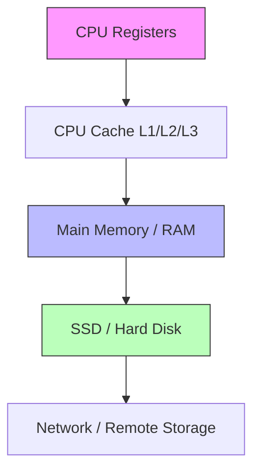

# 01 — Computer Systems Basics

> Before studying LLM inference, you need to understand how a computer stores and processes data. This note gives you the essential vocabulary.

## What you need to know

- What the CPU, RAM, and storage do
- The concept of a **memory hierarchy**
- What a **process** is and what it means to run multiple programs
- The difference between latency and throughput

## The big picture: a computer has layers

| Layer | Size | Speed | Cost | Typical use |
|---|---:|---:|---|---|
| CPU registers | KB | ~1 cycle | Very expensive | Active computation |
| CPU cache | MB | ~10 cycles | Expensive | Recently used data |
| Main memory / RAM | GB | ~100 ns | Moderate | Running programs |
| SSD / NVMe | TB | ~100 μs | Cheap | Persistent storage |
| Network | ∞ | ~1–100 ms | Cheapest | Remote data |

> [!important]
> The closer to the CPU, the **smaller and faster** the memory. The farther away, the **bigger and slower**.

## CPU and GPU

### CPU (Central Processing Unit)

- A small number of powerful cores (4–64 in a laptop/server)
- Good at sequential, complex tasks
- Example: running Python, compiling code, managing the OS

### GPU (Graphics Processing Unit)

- A large number of simpler cores (thousands)
- Good at doing the same operation on many data points at once
- Example: matrix multiplication, neural network training, image rendering

> [!important]
> A GPU is not a "faster CPU." It is a **parallel processor** that is good when the same operation runs on many data items in parallel.

## RAM, disk, and the difference between volatile and persistent

- **RAM (Random Access Memory)** is fast but loses data when power is off. It holds the programs and data currently in use.
- **SSD (Solid State Drive)** is slower but persistent. It holds files, operating systems, and saved data.

When you run a Python program, the OS copies the file from SSD into RAM, then the CPU/GPU reads from RAM.

## Processes and multitasking

A **process** is a running program with its own memory space.

Modern operating systems run many processes at once by:

1. Giving each process a small time slice on the CPU.
2. Switching between processes quickly.
3. Saving/restoring the process state so it can resume.

This switching is called **context switching**. It is the operating-system analogy to what InterruptLLM tries to do for LLM inference: pause one request, run another, then resume.

## Latency vs. throughput

These two words appear everywhere in the paper. Make sure you can distinguish them.

| Term | Meaning | Example |
|---|---|---|
| **Latency** | Time for one task to complete | How long one request takes to finish |
| **Throughput** | Tasks completed per unit time | Requests per second, or tokens per second |

> [!important]
> You can have high throughput but high latency, and vice versa. A long line of people moving slowly through a single door has high throughput but each person waits a long time.

## Bandwidth

**Bandwidth** is the amount of data that can move per second.

- If a pipe can carry 5 liters per second, its bandwidth is 5 L/s.
- If a PCIe link can carry 5 GB/s, then moving 1 GB takes:

$$\text{time} = \frac{\text{size}}{\text{bandwidth}} = \frac{1\text{ GB}}{5\text{ GB/s}} = 0.2\text{ s} = 200\text{ ms}$$

This simple equation is the basis of the GPU swap-latency analysis in the paper.

## How this connects to InterruptLLM

InterruptLLM moves data between GPU memory, CPU memory, and SSD. Understanding the memory hierarchy tells you why this is expensive:

- GPU memory (HBM) is fast but small.
- CPU memory (DRAM) is bigger but slower to access from the GPU.
- SSD is huge but much slower.

The paper's design tries to keep recently preempted KV blocks in CPU memory (the fast fallback) and only push old ones to SSD when CPU memory is full.

## Check your understanding

- [ ] I can explain why CPU cache is faster than RAM.
- [ ] I can explain the difference between latency and throughput.
- [ ] I can compute the time to transfer 2 GB at 10 GB/s.
- [ ] I understand why a GPU is used for matrix multiplication.

## Exercises

1. **Latency exercise:** If your SSD reads 500 MB/s, how long does it take to read a 4 GB file?
2. **Bandwidth exercise:** A GPU can transfer 5 GB/s to CPU memory. How long does 256 MB take?
3. **Conceptual:** Why does the OS need to "save state" when switching between processes? How is that similar to preempting an LLM request?

> [!warning]
> Do not confuse "memory size" (GB) with "memory bandwidth" (GB/s). A 100 GB hard drive can have very low bandwidth. The InterruptLLM paper cares about both: KV cache size is huge, and the bandwidth between GPU and CPU limits how fast it can be swapped.
