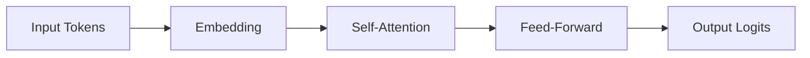
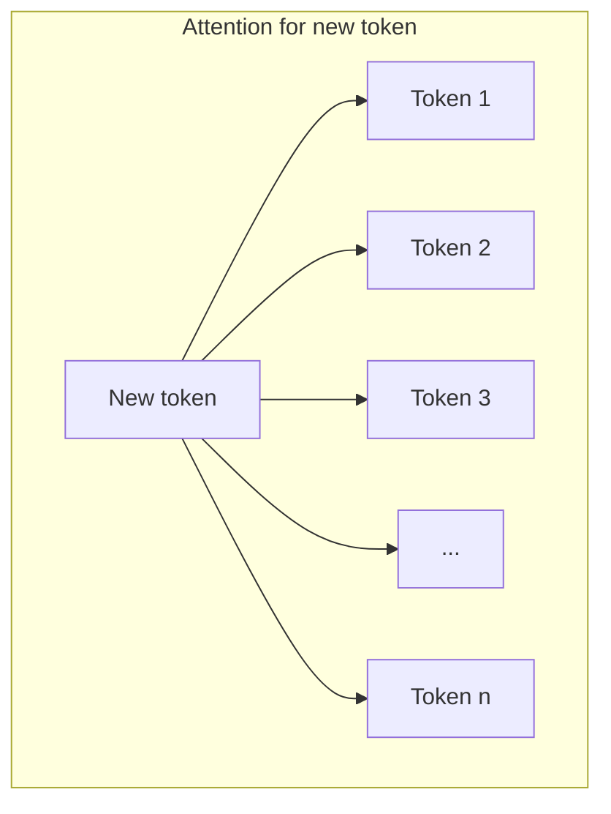
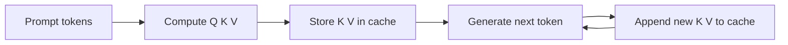

# 02 — Transformer and Attention

> This note explains the transformer architecture and attention mechanism at a conceptual level. You do not need to derive gradients; you need to understand why attention needs memory.

## What is a transformer?

The **transformer** is a neural network architecture introduced in the paper "Attention Is All You Need" (2017). It is the foundation of nearly all modern LLMs.

A transformer processes a sequence of tokens through layers of computation. Each layer has two main parts:

1. **Self-attention:** Each token "looks at" other tokens to understand context.
2. **Feed-forward network:** Each token is transformed independently.



## Self-attention: the core idea

Self-attention lets each token in a sequence pay attention to every other token.

For the sentence:

```
The cat sat on the mat because it was tired.
```

The word "it" must know whether it refers to "cat" or "mat." Self-attention computes this relationship.

### The Q, K, V intuition

For each token, the model computes three vectors:

- **Query (Q):** "What am I looking for?"
- **Key (K):** "What do I contain?"
- **Value (V):** "What information do I provide?"

The attention score between two tokens is computed from how well a Query matches a Key.

> [!important]
> For inference, we need to store the Key and Value vectors of all previously generated tokens. This stored data is called the **KV cache**.

## Why attention is expensive

For a sequence of length $n$, computing all pairs of attention scores requires looking at every token for every new token.



The memory needed for the KV cache grows with sequence length.

## Multi-head attention

The model does not compute attention just once. It computes it many times in parallel, each time with different learned projections. These parallel computations are called **attention heads**.

If there are $h$ heads, the memory and compute cost scale by roughly $h$.

> [!tip]
> Think of multi-head attention as asking the same question from different perspectives. One head might focus on grammar, another on named entities.

## Layer stacking

Transformers stack many attention + feed-forward layers. GPT-style models might have 32, 64, or even more layers.

Each layer adds to the computation and to the memory required for the KV cache.

## What you actually need to remember

For the InterruptLLM paper, the most important facts are:

1. **Attention needs the K and V vectors of all previous tokens.** These must be stored.
2. **The stored K and V vectors are the KV cache.** It grows with sequence length and model layers.
3. **Memory, not compute, is often the bottleneck in LLM inference.** Moving the KV cache is expensive.



## How this connects to InterruptLLM

InterruptLLM's core challenge is moving the KV cache out of the GPU when a request is preempted. To understand why that is hard, you need to know:

- The KV cache is large (can be many gigabytes for long sequences).
- The cache is needed to resume generation later.
- Moving it between GPU and CPU/SSD takes time and bandwidth.

> [!important]
> Without the KV cache, the model would have to recompute attention from scratch every time it generates a token. The KV cache is what makes inference fast, but it is also what makes preemption expensive.

## Check your understanding

- [ ] I can explain self-attention in simple terms.
- [ ] I understand why the KV cache is needed for inference.
- [ ] I know that KV cache memory grows with sequence length and number of layers.
- [ ] I understand why moving the KV cache is the main cost of preemption.

## Exercises

1. In one paragraph, explain what the KV cache is and why it is necessary.
2. Why does the KV cache grow with sequence length?
3. If a model has 32 layers and 8 attention heads, does the KV cache grow with layers or heads? (Both!)

> [!warning]
> Do not worry if you cannot derive the attention equation. Focus on the intuition: each new token needs to look back at all previous tokens, so we must remember their Key and Value vectors.
