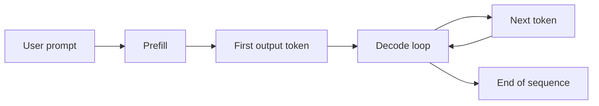
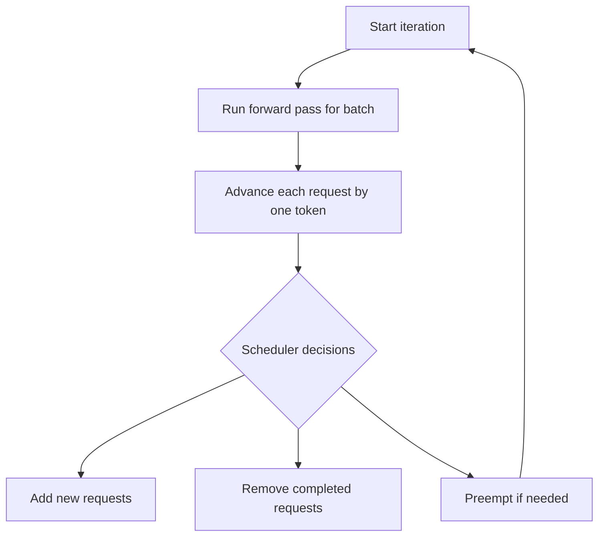

# 03 — Autoregressive Generation

> This note explains the two phases of LLM inference: prefill and decode. Understanding this distinction is essential for the paper.

## The two phases of inference

Every LLM request goes through two phases:

1. **Prefill phase:** Process the entire input prompt.
2. **Decode phase:** Generate output tokens one at a time.



## Prefill phase

During prefill, the model reads the entire prompt in parallel (or in chunks) and computes the KV cache for every token in the prompt.

- **Input:** the user's prompt, e.g., "Summarize this article: ..."
- **Output:** the first generated token
- **Compute:** high because all prompt tokens are processed
- **Memory:** the KV cache is created for every prompt token

> [!important]
> Prefill is usually compute-bound, not memory-bound, because all prompt tokens can be processed in parallel.

## Decode phase

During decode, the model generates one new token per iteration.

For each decode step:

1. The model uses the KV cache from all previous tokens.
2. It computes attention for the new token.
3. It appends the new token's K and V to the KV cache.
4. It outputs the next token.

```
Iteration 1:  "The capital of France is"
              → generate "Paris"
Iteration 2:  "The capital of France is Paris"
              → generate ","
Iteration 3:  "The capital of France is Paris,"
              → generate "the"
...
```

> [!important]
> Decode is usually memory-bound because each step only adds one token but must read the entire KV cache.

## Time-to-First-Token (TTFT) and Time-Per-Output-Token (TPOT)

| Metric | Phase it measures | What it means |
|---|---|---|
| **TTFT** | Prefill | Time until the first token appears |
| **TPOT** | Decode | Average time between generated tokens |

InterruptLLM focuses on **decode-stage preemption**. It does not preempt during prefill.

> [!important]
> TTFT is about prompt processing. TPOT is about generation speed. The paper's latency improvements come from protecting decode latency for interactive requests.

## Iteration boundaries

In a batched serving system, all requests in a batch advance one decode step together. This shared step is called an **iteration** or **decode iteration**.

At the end of each iteration, the scheduler can:

- Remove completed requests from the batch.
- Add newly arrived requests to the batch.
- (In InterruptLLM) preempt lower-priority requests.



> [!important]
> Continuous batching allows adding/removing requests only at iteration boundaries. InterruptLLM adds preemption at these same boundaries.

## Why preemption targets decode, not prefill

1. **Prefill is short:** A few hundred to a few thousand tokens processed once.
2. **Decode is long:** A request can decode for thousands of iterations.
3. **The KV cache exists during decode:** This is the state that must be saved and restored.

Preempting during prefill would be possible, but the payoff is smaller because prefill finishes quickly.

## How this connects to InterruptLLM

The paper's design decisions only make sense once you understand prefill vs. decode:

- InterruptLLM preempts at **decode iteration boundaries**.
- It swaps the **KV cache** of the preempted request.
- It measures **P99 decode latency** for interactive requests.
- Its benchmark uses a swap penalty calibrated to **per-iteration** overhead.

## Check your understanding

- [ ] I can explain the difference between prefill and decode.
- [ ] I know what TTFT and TPOT measure.
- [ ] I understand why decode is memory-bound.
- [ ] I can explain why preemption happens at iteration boundaries.

## Exercises

1. A prompt has 1000 tokens and the model generates 200 tokens. Which phase processes more total tokens? Which phase takes more time?
2. Why does the KV cache only grow during decode, not prefill?
3. If TTFT is 100 ms and TPOT is 20 ms, how long does a 50-token response take (ignoring queueing)?

> [!tip]
> Watch the streaming output of a chatbot. The first token may take longer (TTFT) because prefill is happening. Each subsequent token appears after roughly one TPOT interval.
