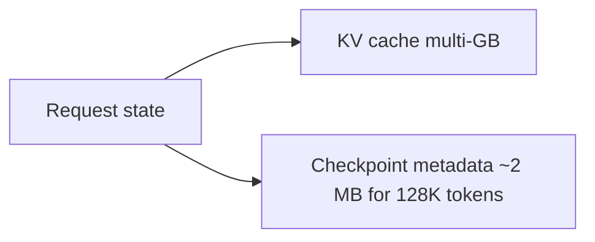

# 04 — KV Cache Explained

> The KV cache is the central object that makes LLM inference fast and preemption expensive. This note explains exactly what it is, how big it gets, and why it matters for InterruptLLM.

## What is the KV cache?

During inference, the transformer needs the Key (K) and Value (V) vectors for every token that has already been processed. Instead of recomputing them each iteration, the model **stores** them in a cache.

The KV cache contains:

- One Key vector per token per layer per head
- One Value vector per token per layer per head

> [!important]
> The KV cache is the "working memory" of a running inference request. Without it, the model would have to recompute everything from scratch for each token.

## How big is the KV cache?

The size of the KV cache for one token is:

$$\text{KV size per token} = 2 \times d_{\text{model}} \times \text{bytes per parameter}$$

where:

- The factor of 2 is for K and V.
- $d_{\text{model}}$ is the model's hidden dimension.
- bytes per parameter is usually 2 for FP16 or 4 for FP32.

### Example: Llama 2 7B

For Llama 2 7B:

- $d_{\text{model}} = 4096$
- FP16 (2 bytes per value)
- KV size per token per layer = $2 \times 4096 \times 2 = 16{,}384$ bytes = 16 KB

With 32 layers:

$$\text{Total KV per token} = 16\text{ KB} \times 32 = 512\text{ KB}$$

> [!important]
> For a 7B-parameter model, the KV cache is about **0.5 MB per token**.

## Scaling with sequence length

For a sequence of length $n$ tokens:

$$\text{Total KV cache} = n \times \text{KV per token}$$

| Sequence length | KV cache size |
|---|---:|
| 1,000 tokens | 500 MB |
| 4,000 tokens | 2 GB |
| 16,000 tokens | 8 GB |
| 128,000 tokens | 64 GB |

> [!warning]
> A 128K-token request needs 64 GB of KV cache for a 7B model. A single consumer GPU often has only 16–24 GB. This is why long-context inference is hard.

## The 16 bytes/token rule of thumb

The paper uses the approximation:

> Checkpoint metadata is ≈16 bytes/token.

This is much smaller than the KV cache because it only stores metadata like block-table mappings, position IDs, and sampling state, not the actual K and V vectors.

## Why KV cache is the bottleneck

Two reasons:

1. **Memory capacity:** Many requests × long sequences can exceed GPU memory.
2. **Memory bandwidth:** Each decode step reads the whole KV cache. The GPU's memory bandwidth limits how fast tokens can be generated.

This is why systems like vLLM optimize KV cache management so aggressively.

## How this connects to InterruptLLM

InterruptLLM's central design challenge is moving the KV cache when preempting:

- A preempted request must leave the GPU.
- Its KV cache must go somewhere: CPU DRAM or SSD.
- Later, it must be brought back to GPU memory to resume.

The cost of this movement is the **swap latency** measured in the paper (Section VI-C).

> [!important]
> The paper's key bet: if swap latency is low enough (sub-10 ms), the latency savings from preemption outweigh the cost of swapping.

## Check your understanding

- [ ] I can explain what the KV cache stores.
- [ ] I can estimate KV cache size for a given sequence length.
- [ ] I understand why the KV cache is memory-intensive.
- [ ] I know the difference between KV cache and checkpoint metadata.

## Exercises

1. Estimate the KV cache size for a 4,096-token sequence using Llama 2 7B. (Hint: 0.5 MB per token.)
2. A 128K-token request has a 64 GB KV cache. The paper says checkpoint metadata is ~2 MB. What fraction of the total state is the metadata? (2 MB / 64 GB ≈ 0.003%.)
3. Why does moving the KV cache dominate preemption cost, while checkpoint metadata is negligible?

> [!tip]
> Memorize the rule of thumb: ~0.5 MB per token for a 7B model. This lets you quickly estimate whether a GPU can hold a batch of requests.
