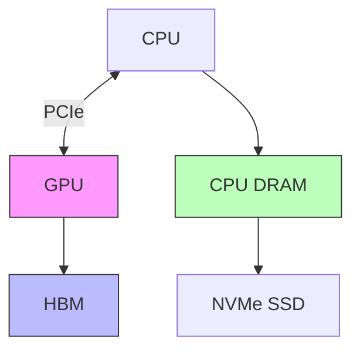
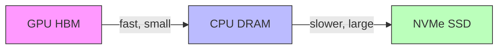

# 01 — GPU Memory Hierarchy

> This note explains the memory system inside and around a GPU. Understanding this is essential for understanding why InterruptLLM's hierarchical swapper makes sense.

## What is inside a GPU?

A modern GPU has:

- **Compute units / SMs:** The cores that do arithmetic.
- **High Bandwidth Memory (HBM):** Fast memory directly attached to the GPU die.
- **Memory controllers:** Manage traffic to and from HBM.
- **PCIe interface:** Connects the GPU to the CPU and the rest of the computer.

## GPU memory: HBM

**High Bandwidth Memory (HBM)** is stacked memory located very close to the GPU die. It provides enormous bandwidth but is expensive and limited in capacity.

| GPU | HBM capacity | HBM bandwidth | Year |
|---|---:|---:|---:|
| NVIDIA P100 | 16 GB | 732 GB/s | 2016 |
| NVIDIA A100 | 40/80 GB | 1,935 GB/s | 2020 |
| NVIDIA H100 | 80 GB | 3,350 GB/s | 2022 |

> [!important]
> HBM bandwidth is the speed of moving data *inside* the GPU. It is much faster than the speed of moving data *out of* the GPU over PCIe.

## Host memory: CPU DRAM

The CPU has its own main memory, usually DDR4 or DDR5.

- Typical capacity: 64–512 GB
- Typical bandwidth: 50–200 GB/s
- Accessed by the CPU quickly, by the GPU slowly (over PCIe)

## Storage: NVMe SSD

NVMe SSDs are persistent storage devices.

- Typical capacity: 1–8 TB
- Typical read/write bandwidth: 3–7 GB/s
- Latency: ~100 μs

## The bandwidth gap

The most important number for InterruptLLM is not HBM bandwidth; it is the **PCIe bandwidth** between GPU and CPU.

| Link | Bandwidth per direction |
|---:|---:|
| PCIe Gen3 x16 | ~16 GB/s |
| PCIe Gen4 x16 | ~32 GB/s |
| PCIe Gen5 x16 | ~64 GB/s |

However, **effective** bandwidth is lower due to protocol overhead, drivers, and memory pinning. The paper measures ~5 GB/s effective on a P100 (PCIe Gen3 x16).

> [!important]
> The gap between "ideal PCIe bandwidth" and "measured effective bandwidth" is one of the paper's main empirical findings.

## Why three tiers?

InterruptLLM uses three tiers because each has a different trade-off:

| Tier | Capacity | Speed to GPU | Use case |
|---|---|---|---|
| GPU HBM | Small (16–80 GB) | Fastest | Active requests |
| CPU DRAM | Large (256–512 GB) | Medium | Recently preempted requests |
| NVMe SSD | Huge (TBs) | Slowest | Long-term overflow |

## Memory pinning

For the GPU to transfer data to CPU memory efficiently, the CPU memory must be **pinned** (page-locked). Without pinning, the CPU must first copy data into a pinned buffer before the GPU can DMA it.

The paper notes that real implementations would use pinned memory and DMA streams; its benchmark measures unoptimized PyTorch transfers, which is why the measured bandwidth is lower.

## How this connects to InterruptLLM

The design of InterruptLLM is a direct response to this hierarchy:

- Active requests stay in **HBM** because it is fastest.
- Preempted requests move to **CPU DRAM** because it is the fastest large-capacity fallback.
- Only when CPU DRAM is full do requests move to **NVMe SSD**.

The paper measures the GPU→CPU transfer cost to calibrate the simulator.

## Check your understanding

- [ ] I can name the three memory tiers InterruptLLM uses.
- [ ] I understand why HBM is fast but small.
- [ ] I know the approximate PCIe Gen3 and Gen4 bandwidths.
- [ ] I understand why measured effective bandwidth is lower than ideal bandwidth.

## Exercises

1. Why does moving data from GPU to CPU take much longer than moving data within the GPU?
2. Rank HBM, CPU DRAM, and NVMe SSD by capacity and by speed.
3. If CPU DRAM can hold 320 GB (the paper's assumption) and a 7B model needs 0.5 MB per token, how many tokens of KV cache can CPU DRAM hold? (Answer: ~640 million tokens.)

> [!warning]
> Do not confuse HBM bandwidth with PCIe bandwidth. HBM bandwidth is the speed of reading from GPU memory during inference. PCIe bandwidth is the speed of moving data between GPU and CPU. Preemption cost depends on PCIe bandwidth, not HBM bandwidth.
