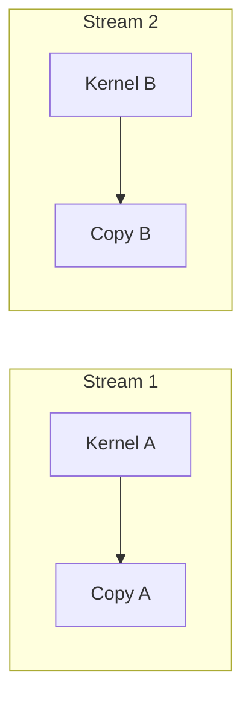

# 02 — CUDA and Bandwidth

> This note introduces CUDA concepts at a level sufficient to understand the paper's GPU benchmark. No CUDA programming is required.

## What is CUDA?

**CUDA** is NVIDIA's parallel computing platform. It lets programs run code on the GPU.

CUDA provides:

- A programming language (C/C++ extensions)
- A runtime API for memory management and launches
- Libraries like cuBLAS and cuDNN

The paper uses PyTorch, which calls CUDA under the hood.

## Host vs. device

In CUDA terminology:

- **Host** = the CPU and its memory
- **Device** = the GPU and its memory

Moving data from host to device is a **host-to-device transfer (H2D)**.
Moving data from device to host is a **device-to-host transfer (D2H)**.

InterruptLLM's preemption involves D2H transfers (GPU to CPU) and later H2D transfers (CPU to GPU).

## cudaMemcpyAsync

The paper's benchmark uses `cudaMemcpyAsync`, an API that copies memory between host and device.

```cpp
cudaMemcpyAsync(dst, src, size, cudaMemcpyDeviceToHost, stream);
```

Key properties:

- **Async** means the call returns before the copy finishes; the CPU can do other work.
- The copy happens on a **CUDA stream**, a queue of GPU operations.
- Transfers can overlap with GPU computation if well scheduled.

> [!important]
> `cudaMemcpyAsync` is asynchronous, but the benchmark still waits for it to complete before measuring latency. The measured time is the actual transfer duration, not just the API call duration.

## Pinned (page-locked) memory

By default, CPU memory is **pageable**: the OS can move it around.
For GPU DMA, the memory must be **pinned** so the OS does not move it.

Without pinned memory, the CUDA driver must first copy data to a temporary pinned buffer, then transfer it. This adds overhead.

The paper notes that its P100 benchmark does not use pinned memory, which contributes to the gap between measured and ideal bandwidth.

## CUDA streams

A **CUDA stream** is a sequence of GPU operations executed in order. Multiple streams can run concurrently.



For InterruptLLM, separate streams could allow:

- One stream doing compute (decode step)
- Another stream doing memory transfers (KV swap)

This overlap would hide swap latency.

## Bandwidth formula

The time to move a block of size $S$ over a link with bandwidth $B$ is:

$$t = \frac{S}{B}$$

For example, moving 1 GB at 5 GB/s takes 200 ms.

In practice, there is also a **fixed overhead per transfer**. The paper observes that measured latency is higher than the simple formula predicts, especially for small blocks.

## How this connects to InterruptLLM

The paper's GPU benchmark (`phase5a`) does the following:

1. Create a tensor in GPU memory.
2. Call `cudaMemcpyAsync` (via PyTorch `.cpu()`) to copy it to CPU memory.
3. Synchronize and measure time.
4. Repeat for block sizes from 32 MB to 1 GB.

This measures the raw D2H transfer time that a swapper would experience.

> [!important]
> Understanding CUDA basics helps you interpret Section VI-C of the paper: the measured latency is higher than the analytical model because of real-world transfer overhead, PyTorch allocator interactions, and lack of pinned memory.

## Check your understanding

- [ ] I know what CUDA is and what it is used for.
- [ ] I understand the difference between host and device memory.
- [ ] I know what `cudaMemcpyAsync` does.
- [ ] I understand why pinned memory matters for GPU transfers.

## Exercises

1. What is a D2H transfer in CUDA terms?
2. Why is `cudaMemcpyAsync` called "async" even though the benchmark waits for it?
3. How could multiple CUDA streams help hide swap latency?

> [!tip]
> You do not need to write CUDA code. Just understand that GPU→CPU transfers are real, measurable operations with bandwidth limits and overhead.
