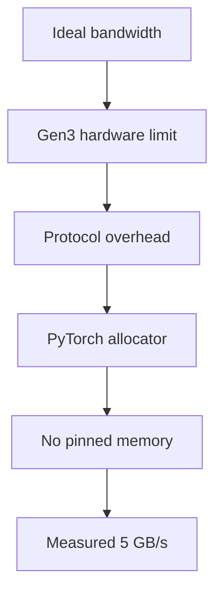

# 03 — Measuring Swap Latency

> This note walks through the GPU benchmark in the paper and explains how the measured swap latencies are interpreted.

## What the benchmark measures

The paper measures the time to copy a tensor from GPU memory to CPU memory using `cudaMemcpyAsync`. This is the primitive operation behind InterruptLLM's context swapper.

Hardware used:

- NVIDIA P100
- PCIe Gen3 x16
- 16 GB HBM

Measured effective bandwidth: **~5 GB/s**

## Measured results

| Block size | Measured latency | Analytical (Gen4) | Modeled + LZ4 |
|---:|---:|---:|---:|
| 32 MB | 6.7 ms | 1.0 ms | 2.2 ms |
| 64 MB | 13.2 ms | 2.0 ms | 4.5 ms |
| 128 MB | 26.5 ms | 4.0 ms | 8.8 ms |
| 256 MB | 55.0 ms | 8.0 ms | 18.4 ms |
| 512 MB | 105.3 ms | 16.0 ms | 35.1 ms |
| 1 GB | 208.0 ms | 32.0 ms | 69.9 ms |

> [!important]
> The measured latency is **6–7× higher** than the analytical model based on Gen4 bandwidth. This is a key empirical finding.

## Why the gap?

Several factors cause the measured latency to exceed the simple bandwidth model:

1. **PCIe Gen3 vs. Gen4:** The P100 uses older Gen3, which has half the bandwidth of Gen4.
2. **Effective vs. ideal bandwidth:** Protocol overhead, drivers, and memory allocation reduce effective throughput.
3. **Per-transfer overhead:** Each transfer has fixed setup cost.
4. **PyTorch allocator overhead:** The benchmark uses PyTorch tensors, which add bookkeeping.
5. **No pinned memory:** CPU memory is not page-locked, adding extra copies.

## Why the simulator uses 0.5 ms

The simulator uses a per-preemption swap penalty of **0.5 ms**. This seems much smaller than the table above. Why?

Because InterruptLLM only evicts a **small hot footprint** per preemption. It does not swap the entire request context. The paper estimates this footprint at roughly **2.5 MB**:

$$t = \frac{2.5\text{ MB}}{5\text{ GB/s}} = \frac{2.5 \times 10^{-3}\text{ GB}}{5\text{ GB/s}} = 0.5\text{ ms}$$

> [!important]
> The 0.5 ms penalty represents a small, realistic per-preemption transfer, not a full KV-cache eviction.

## The 10 ms target

The paper says the target restore latency is below 50 ms and the sub-10 ms swap target is important for P0 latency. Looking at the table:

- With LZ4 compression and modern Gen4 hardware, a 1 GB block can swap in ~11 ms.
- With only the small hot footprint, the actual cost is much lower.

## How this connects to InterruptLLM

The benchmark serves two purposes:

1. **Calibrate the simulator:** The 0.5 ms swap penalty is grounded in real measured bandwidth.
2. **Validate an assumption:** It confirms that swap latency is not just a bandwidth-limited transfer; real systems have overhead.

> [!important]
> The benchmark validates the *memcpy component* of preemption, not the full end-to-end preemption latency. This is a limitation the paper acknowledges.

## Check your understanding

- [ ] I can explain why measured P100 bandwidth (~5 GB/s) is lower than ideal Gen4 bandwidth (32 GB/s).
- [ ] I can derive the 0.5 ms simulator penalty from 2.5 MB at 5 GB/s.
- [ ] I understand the difference between full KV-cache swap and small hot-footprint swap.
- [ ] I can explain what the benchmark validates and what it does not.

## Exercises

1. How long does it take to transfer 512 MB at 5 GB/s? Compare to the measured 105.3 ms. Why is the measured value higher?
2. If the simulator used a full 1 GB swap per preemption, what would the swap penalty be at 5 GB/s? Would the system still work well?
3. Why is it important that the swap penalty is small relative to the decode iteration time?

> [!warning]
> The paper's analytical model assumes ideal Gen4 bandwidth. Real hardware and software stacks achieve much less. Always distinguish between theoretical bandwidth and measured effective bandwidth.
