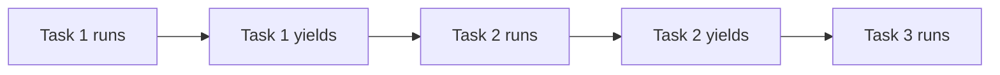
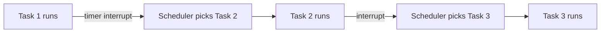

# 01 — Scheduling Fundamentals

> This note explains what scheduling is, why it matters, and the core concepts of preemptive vs. cooperative scheduling. This is the OS background you need to understand InterruptLLM.

## What is scheduling?

A **scheduler** decides which task runs next and for how long. Every multitasking system has one:

- Your operating system schedules processes on CPU cores.
- A web server schedules incoming requests across worker threads.
- An LLM serving system schedules decode requests on a GPU.

## Goals of scheduling

Different schedulers optimize for different goals:

| Goal | Meaning |
|---|---|
| **Low latency** | Minimize time for individual tasks to finish |
| **High throughput** | Maximize number of tasks completed per second |
| **Fairness** | Give each task a reasonable share |
| **Priority** | Prefer important or urgent tasks |
| **No starvation** | Every task eventually gets service |

> [!important]
> You cannot usually optimize all goals at once. A scheduler is a trade-off.

## Cooperative vs. preemptive scheduling

### Cooperative scheduling

A task keeps running until it voluntarily gives up control.

Pros:

- Simple to implement
- No context-switch overhead

Cons:

- A long-running task can block everyone else
- No guarantees for latency-sensitive tasks

### Preemptive scheduling

The scheduler can interrupt a running task and switch to another task.

Pros:

- Latency-sensitive tasks can get CPU quickly
- Fairness and priorities can be enforced

Cons:

- Context-switch overhead
- More complex to implement

> [!important]
> Modern operating systems are preemptive. Modern LLM serving systems are mostly cooperative: a running decode request cannot be interrupted until it finishes.

## Context switching

Preemptive scheduling requires **context switching**: saving the state of the running task and loading the state of the new task.

For a CPU process, the state includes:

- Program counter
- Register values
- Memory page tables
- Open file descriptors

For an LLM request, the state includes:

- KV cache
- Block table mapping
- Position IDs
- Sampling state
- Generated tokens so far

InterruptLLM is essentially a context-switching mechanism for LLM inference requests.

## How this connects to InterruptLLM

The paper's core contribution is making LLM inference scheduling **preemptive** at decode iteration boundaries.

- Before: continuous batching is cooperative; long requests block short ones.
- After: InterruptLLM can preempt a long request, swap its KV cache, and run an interactive request.

This is directly analogous to how OS schedulers preempt long CPU processes to run interactive ones.

## Check your understanding

- [ ] I can explain the difference between cooperative and preemptive scheduling.
- [ ] I can list the goals of a scheduler.
- [ ] I know what a context switch saves and restores.
- [ ] I understand why LLM serving is currently cooperative.

## Exercises

1. Give a real-world example of cooperative multitasking (e.g., a single-threaded event loop).
2. Give a real-world example of preemptive multitasking (e.g., your laptop running many apps).
3. What would the "context" of an LLM request include?

> [!tip]
> Think of a restaurant kitchen. Cooperative scheduling is like letting one chef finish an entire dish before another starts. Preemptive scheduling is like a head chef pausing a long dish to start an urgent one, then returning later.
