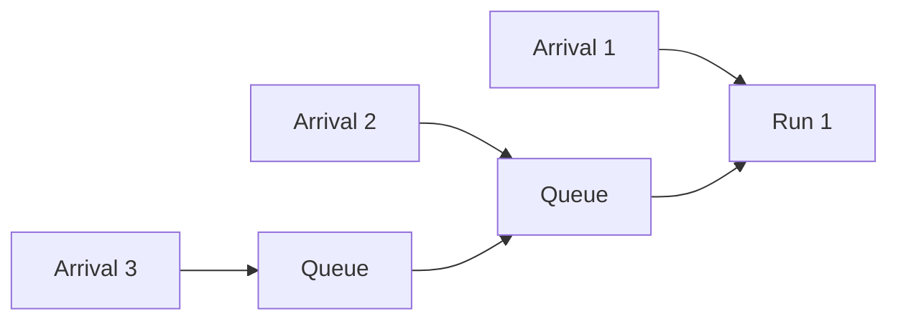
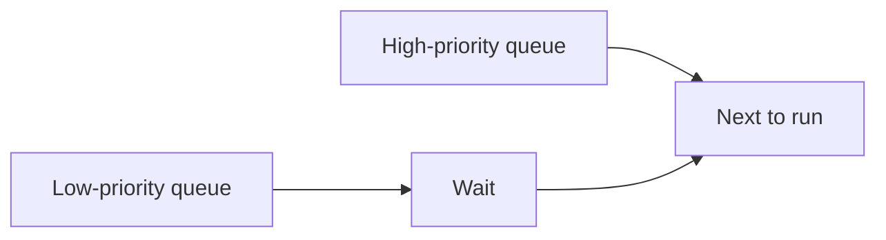

# 02 — Scheduling Algorithms

> This note explains the scheduling algorithms compared in the InterruptLLM paper: FCFS, Priority, SSJF, Lottery, WFQ, and EDF.

## First-Come, First-Served (FCFS)

Also called FIFO (First-In, First-Out).

- Requests are served in arrival order.
- Once a request starts, it runs to completion.



**Pros:** Simple, fair in arrival order.

**Cons:** A long request can block many short ones. This is the **head-of-line blocking** problem.

> [!important]
> FCFS is the baseline for many LLM serving systems (continuous batching is essentially FCFS within the batch).

## Priority Scheduling

Each request has a priority. Higher-priority requests are admitted first.



**Pros:** Important requests get preferential treatment.

**Cons:** Non-preemptive priority only affects admission order. A low-priority request already running still blocks high-priority arrivals.

> [!important]
> The paper compares against a **non-preemptive priority** baseline. This shows that reordering admission is not enough; you need preemption.

## Shortest-Remaining-Time-First (SRJF / SSJF)

Run the request with the smallest remaining work first.

```
Remaining tokens:
  A: 1000 tokens
  B: 50 tokens
  C: 200 tokens
Order: B, C, A
```

**Pros:** Minimizes average completion time.

**Cons:** Requires knowing the future. Can starve long requests if short requests keep arriving.

In the paper, SSJF is one of the ablation baselines.

## Lottery Scheduling

Each request gets "tickets." The scheduler holds a lottery and picks the winner.

```
P0: 100 tickets
P1: 50 tickets
P2: 20 tickets
P3: 5 tickets

P(P0 wins) = 100 / 175 ≈ 57%
```

**Pros:** Simple, probabilistically fair, easy to implement weights.

**Cons:** No deterministic guarantees; P0 requests can lose repeatedly in short bursts.

## Weighted Fair Queueing (WFQ)

Give each request a share of capacity proportional to its weight.

```
Weight = 1 / (priority + 1)
P0 has weight 1/1 = 1
P1 has weight 1/2 = 0.5
P2 has weight 1/3 ≈ 0.33
P3 has weight 1/4 = 0.25
```

**Pros:** Fair allocation over time.

**Cons:** In short bursts, WFQ may not serve all P0 requests first; it aims for long-term fairness.

## Earliest-Deadline-First (EDF)

Each request has a deadline. The scheduler runs the request with the soonest deadline.

```
A: deadline = 100 ms
B: deadline = 50 ms
C: deadline = 200 ms
Order: B, A, C
```

**Pros:** Optimal for meeting deadlines in many theoretical settings.

**Cons:** Needs a deadline for each request. In LLM inference, the deadline is not naturally known, so the paper uses remaining tokens as a proxy.

## Summary table

| Algorithm | Preemptive? | Uses priorities? | Main risk |
|---|---|---|---|
| FCFS | No | No | Head-of-line blocking |
| Priority | No | Yes | Running low-priority blocks high-priority arrivals |
| SSJF | Yes | No | Starvation of long requests |
| Lottery | Yes | Probabilistic | Bursty variance |
| WFQ | Yes | Yes | Long-term fairness, not burst latency |
| EDF | Yes | Yes | Needs accurate deadlines |
| MLFQ | Yes | Yes | Priority inversion if not tuned |

> [!important]
> InterruptLLM uses **MLFQ** (Multi-Level Feedback Queue), which is a priority scheduler with aging to prevent starvation.

## How this connects to InterruptLLM

Section VI of the paper compares InterruptLLM against all these baselines:

- FCFS and Priority show the non-preemptive problem.
- SSJF, Lottery, WFQ, and EDF show that other preemptive policies do not solve the priority problem as cleanly as MLFQ.
- MLFQ combines strict priority with round-robin within classes and aging across classes.

## Check your understanding

- [ ] I can explain FCFS and its head-of-line blocking problem.
- [ ] I can explain why non-preemptive priority scheduling is not enough.
- [ ] I can describe SSJF, Lottery, WFQ, and EDF in one sentence each.
- [ ] I understand why MLFQ is used in InterruptLLM.

## Exercises

1. List the arrival order of 5 requests under FCFS.
2. Under non-preemptive priority, what happens when a high-priority request arrives while a low-priority request is already running?
3. Why might SSJF starve long requests?
4. Why does WFQ not guarantee that all P0 requests are served immediately?

> [!warning]
> Do not confuse "preemptive" with "priority." A scheduler can have priority without preemption (the paper's Priority baseline), and it can have preemption without strict priority (SSJF). InterruptLLM combines both.
