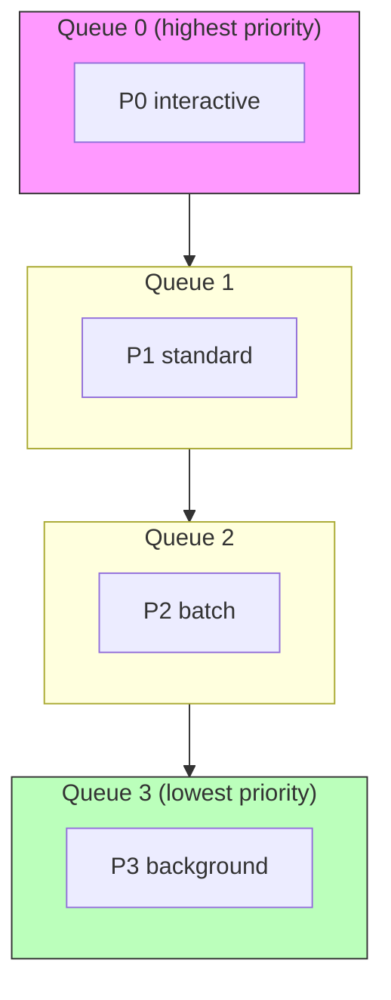

# 03 — MLFQ Deep Dive

> InterruptLLM uses a Multi-Level Feedback Queue (MLFQ) scheduler. This note explains how MLFQ works, why it is powerful, and how it prevents starvation.

## What is MLFQ?

MLFQ is a classic scheduling algorithm that assigns processes to multiple priority queues. The scheduler always picks the highest-priority non-empty queue.



## How MLFQ decides priorities

Processes start in a high-priority queue. If they use their full time slice without yielding, they are demoted to a lower-priority queue.

Interactive processes (which often yield quickly) stay in high-priority queues. CPU-bound processes (which use their full time slice) drift down to lower-priority queues.

## InterruptLLM's four priority classes

The paper uses a static MLFQ with four classes:

| Class | Workload | Target P99 |
|---|---|---|
| **P0** | Interactive: chat, code completion | < 200 ms |
| **P1** | Standard: general API requests | < 1 s |
| **P2** | Batch: summarization, embedding | Best-effort |
| **P3** | Background: fine-tuning data generation | Preemptible anytime |

```mermaid
flowchart TD
    P0[\"P0: Interactive<br/>chat, code completion<br/>target < 200 ms\"] --> P1[\"P1: Standard<br/>general API<br/>target < 1 s\"]
    P1 --> P2[\"P2: Batch<br/>summarization<br/>best-effort\"]
    P2 --> P3[\"P3: Background<br/>preemptible anytime\"]

    style P0 fill:#f9f,stroke:#333
    style P3 fill:#bfb,stroke:#333
```

> [!important]
> In InterruptLLM, the priority class is assigned by the task type, not learned from behavior. This is a simpler, static MLFQ.

## Round-robin within a class

Within each priority class, requests are served in **round-robin** order. This prevents any single request within a class from monopolizing the GPU.

```
P0 queue: [R1, R2, R3, R4]
Service order: R1, R2, R3, R4, R1, R2, ...
```

## Aging to prevent starvation

What if P0 requests keep arriving forever? P1/P2/P3 requests would never run.

MLFQ solves this with **aging**: a request that has waited longer than a threshold is promoted to a higher-priority class.

```
P2 request has waited > threshold
→ promote to P1 queue
→ now has higher priority
```

> [!important]
> Aging is a starvation-freedom guarantee. In the paper, it has little effect because P0 arrivals are frequent enough that P1 still gets service.

## Victim selection

When a high-priority request arrives and the batch is full, the scheduler must pick a **victim** to preempt.

InterruptLLM's victim selection criteria:

1. The victim must have **lower priority** than the arriving request.
2. Among eligible victims, pick the one with the **largest KV footprint**.

Reasoning: evicting the largest victim frees the most memory in one preemption.

> [!tip]
> The paper also evaluates smallest-footprint and cost-aware ($\text{footprint} / \text{priority}$) policies. They yield identical results because preemptions are rare and the preempted requests are small.

## How MLFQ handles bursts

During a burst of P0 requests, MLFQ:

1. Immediately preempts lower-priority requests in the batch.
2. Runs P0 requests first.
3. Lets P1/P2/P3 resume when P0 load drops.

This is exactly the behavior needed for interactive chat or code completion during a batch summarization job.

## How this connects to InterruptLLM

Algorithm 1 in the paper (Section IV-E) is the formal MLFQ scheduling loop:

1. Enqueue new arrivals.
2. Sort by priority.
3. Fill the batch with highest-priority requests.
4. If a high-priority request does not fit, preempt the lowest-priority largest-footprint request.
5. Run one decode step.
6. Apply aging.

This is the heart of the InterruptLLM design.

## Check your understanding

- [ ] I can explain why MLFQ uses multiple queues.
- [ ] I know the four priority classes in InterruptLLM and their targets.
- [ ] I can explain round-robin within a class.
- [ ] I can explain aging and why it prevents starvation.
- [ ] I can explain the victim selection rule.

## Exercises

1. Suppose a P0 request arrives while the batch is full of P2 requests. What happens under MLFQ?
2. Why does round-robin within a class matter?
3. What would happen without aging if P0 requests kept arriving continuously?
4. Why does the largest-footprint victim selection make sense?

> [!warning]
> Do not think of MLFQ as just "priority scheduling." The combination of multiple queues, round-robin within a class, and aging across classes is what makes it robust for mixed workloads.
