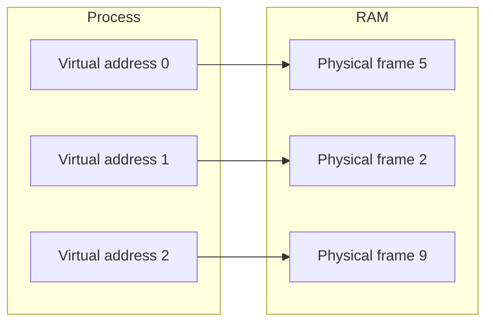
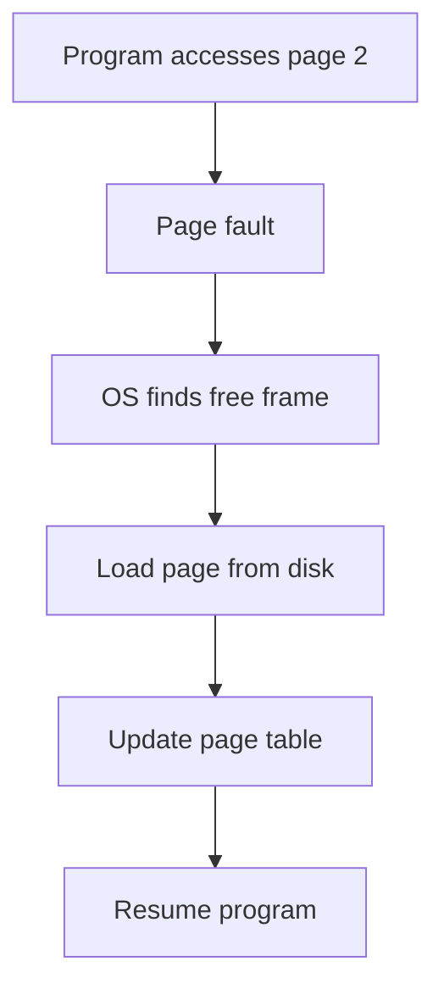

# 04 — Virtual Memory and Paging

> This note explains virtual memory, page tables, and paging. These concepts are the direct analogy for vLLM's PagedAttention, which uses block tables to manage the KV cache.

## What is virtual memory?

Virtual memory allows each program to use a large, contiguous address space while its data is actually scattered in physical RAM.



**Benefits:**

- Programs can use more memory than physical RAM (swapping to disk).
- Programs are isolated from each other.
- Memory can be allocated non-contiguously.

## Pages and frames

- **Virtual address space** is divided into fixed-size blocks called **pages**.
- **Physical memory** is divided into same-size blocks called **frames**.
- A **page table** maps virtual pages to physical frames.

| Virtual page | Physical frame | Present? |
|:-:|:-:|:--|
| 0 | 5 | Yes |
| 1 | 2 | Yes |
| 2 | — | No (on disk) |

## Swapping

When physical memory is full, the OS can move a page to disk and mark its page table entry as "not present."

When the program accesses that page, a **page fault** occurs, and the OS loads the page back from disk.



> [!important]
> Paging is the OS-level version of what InterruptLLM does for the KV cache. The GPU is like physical RAM; the CPU/SSD is like disk.

## Page tables vs. block tables

| OS concept | vLLM/PagedAttention equivalent |
|---|---|
| Virtual page | Block index in the request's logical sequence |
| Physical frame | GPU physical block location |
| Page table | Block table |
| Swapping to disk | Moving KV blocks to CPU/SSD |
| Page fault | Cache miss when a block is not on GPU |

## Why non-contiguous allocation matters

In traditional memory allocation, a request might ask for a large contiguous block:

```
Request A: 100 MB contiguous
Request B: 50 MB contiguous
```

After fragmentation, the memory might look like this:

```
[A used][free 40 MB][B used][free 30 MB]
```

Even though there is 70 MB free, neither request can be satisfied because no contiguous block is large enough.

Paging solves this by mapping non-contiguous frames to a contiguous virtual address space.

## How this connects to InterruptLLM

PagedAttention uses fixed-size blocks to store KV cache. Each request has a **block table** mapping logical token positions to physical GPU blocks.

InterruptLLM exploits this to:

1. **Swap individual blocks** rather than entire sequences.
2. **Move blocks to CPU DRAM or SSD** without needing a contiguous GPU buffer.
3. **Reconstruct the block table** on resume using the checkpoint engine.

> [!important]
> Without PagedAttention's block tables, preempting a request would require moving the entire contiguous KV cache. With block tables, only the blocks that do not fit need to be moved.

## Check your understanding

- [ ] I can explain virtual memory and why it is useful.
- [ ] I can explain the difference between a page and a frame.
- [ ] I know what a page table is.
- [ ] I understand the analogy between OS paging and PagedAttention block tables.

## Exercises

1. Why is non-contiguous allocation useful for memory management?
2. What happens when a program accesses a page that is marked "not present"?
3. Map the OS paging concepts to PagedAttention: page, frame, page table, swap space.
4. Why would moving a contiguous KV cache be harder than moving fixed-size blocks?

> [!tip]
> The block table is the key insight that makes InterruptLLM practical. It is the bridge between classic OS virtual memory and modern LLM serving.
