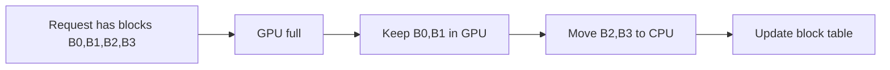

# 01 — vLLM and PagedAttention

> This note explains PagedAttention, the key technique from vLLM that makes InterruptLLM's block-granular preemption possible.

## The memory allocation problem

In early LLM serving systems, each request's KV cache was stored in one large contiguous chunk of GPU memory.

```
GPU Memory:
[Request A: 100 MB][free 20 MB][Request B: 50 MB][free 30 MB]
```

Problems:

1. **Internal fragmentation:** A request might not use all of its allocated chunk.
2. **External fragmentation:** Free memory is split into small non-contiguous pieces.
3. **No sharing:** Blocks cannot be reused across requests.

## PagedAttention's solution

PagedAttention (introduced in vLLM) stores the KV cache in fixed-size **blocks**, similar to OS virtual memory pages.

```
GPU Memory (blocks):
[A1][A2][B1][free][A3][B2][free][C1][A4]
```

Each request has a **block table** that maps logical token positions to physical blocks.

## The block table

| Logical block | Physical block |
|:-:|:-:|
| 0 | 7 |
| 1 | 2 |
| 2 | 5 |

> [!important]
> Logical positions are contiguous; physical positions are not. This is exactly like virtual memory.

## Benefits of PagedAttention

1. **No contiguous allocation needed:** Blocks can be scattered anywhere in GPU memory.
2. **Reduced fragmentation:** Only used blocks are allocated.
3. **Easy sharing:** Multiple requests can share the same physical block.
4. **Swappable blocks:** Individual blocks can be moved to CPU or SSD.

## Block size

vLLM uses a default block size of 16 tokens. Each block holds KV vectors for 16 consecutive tokens.

```
Tokens:  [0..15]  [16..31]  [32..47]  ...
Blocks:  [  B0  ] [   B1  ] [   B2  ] ...
```

> [!important]
> The paper uses a block size of 16 tokens in the simulator (Table I: Simulation parameters).

## Block tables enable preemption

Because blocks are independent and self-contained, the scheduler can:

1. Choose which blocks to keep in GPU memory.
2. Move other blocks to CPU DRAM or SSD.
3. Update the block table to reflect the new location.
4. On resume, bring the blocks back and restore the block table.



## How this connects to InterruptLLM

InterruptLLM is built on top of the PagedAttention abstraction:

- The **Context Swapper** moves KV blocks, not arbitrary byte ranges.
- The **Checkpoint Engine** stores the block table and metadata.
- The **MLFQ Scheduler** reasons about preemption cost in terms of block counts.

Without PagedAttention, preemption would require moving a huge contiguous tensor. With PagedAttention, only the necessary blocks are swapped.

> [!important]
> PagedAttention is the enabling technology. InterruptLLM adds preemption on top of it.

## Check your understanding

- [ ] I can explain why contiguous KV cache allocation causes fragmentation.
- [ ] I understand what a block table is.
- [ ] I know the default vLLM block size (16 tokens).
- [ ] I can explain why block tables make preemption feasible.

## Exercises

1. Draw a block table for a request with tokens 0–47, using a block size of 16.
2. If blocks are scattered physically but mapped logically, why is external fragmentation reduced?
3. Why can blocks be shared between requests in vLLM?

> [!warning]
> Do not confuse the block table with the KV cache itself. The block table is a mapping. The KV cache is the actual data. Both must be saved on preemption.
