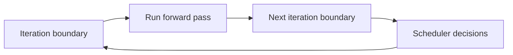

# 02 — Continuous Batching

> Continuous batching is the standard technique for maximizing GPU throughput in LLM inference. This note explains how it works and why it is non-preemptive.

## Static batching

In **static batching**, a group of requests is processed together from start to finish. All requests must wait for the slowest one.

```
Request A: 10 tokens to generate
Request B: 100 tokens to generate
Static batch: A waits for B to finish all 100 tokens
```

This wastes time because A finishes early but cannot leave the batch.

## Continuous batching

In **continuous batching** (also called iteration-level scheduling or in-flight batching), requests can join or leave the batch at every decode iteration.

```mermaid
flowchart TD
    subgraph Iteration 1
        A[Req A: decode step 1]
        B[Req B: decode step 1]
    end
    subgraph Iteration 2
        C[Req A: decode step 2]
        D[Req B: decode step 2]
        E[Req C: decode step 1 - newly admitted]
    end
    subgraph Iteration 3
        F[Req B: decode step 3]
        G[Req C: decode step 2]
        H[Req D: decode step 1 - newly admitted]
    end
    Iteration 1 --> Iteration 2
    Iteration 2 --> Iteration 3
```

> [!important]
> Continuous batching improves throughput by keeping the GPU busy with a full batch at every iteration.

## The non-preemptive limitation

Continuous batching can add and remove requests, but it cannot **pause a running request mid-decode** to serve a more urgent one.

Once a request is in the batch, it stays until it completes.

```
Batch contains: [long summarization job, short chat request]
A new urgent chat request arrives
Problem: it must wait until the next iteration boundary
```

At the iteration boundary, the long job is still running, so the urgent request may wait many iterations.

## Iteration boundaries are the only opportunities

The scheduler can make changes only at iteration boundaries because the GPU runs a single forward pass for the entire batch.



This is similar to how an OS scheduler only runs at timer interrupts or system calls.

## Why continuous batching is cooperative

A running request "cooperates" by running until it finishes. It is never forced to yield.

This is fine when all requests are similar, but it fails when:

- A long batch job runs alongside short interactive requests.
- A low-priority request is already in the batch when a high-priority request arrives.

## How this connects to InterruptLLM

InterruptLLM keeps continuous batching but adds **preemption** at iteration boundaries:

- Requests still join/leave at iteration boundaries.
- Now, lower-priority requests can be evicted from the batch at boundaries.
- Their KV blocks are swapped to CPU/SSD.
- They resume later when higher-priority work finishes.

> [!important]
> InterruptLLM does not replace continuous batching; it extends it with preemption.

## Check your understanding

- [ ] I can explain static batching and its problem.
- [ ] I can explain continuous batching and its advantage.
- [ ] I understand why continuous batching is non-preemptive.
- [ ] I know what an iteration boundary is.

## Exercises

1. Why is static batching inefficient when requests have different lengths?
2. In continuous batching, when can new requests join the batch?
3. Why can a long-running request block a newly arrived urgent request under continuous batching?
4. How does InterruptLLM change the behavior at iteration boundaries?

> [!tip]
> Think of continuous batching as a bus that stops at every station (iteration boundary). Passengers can get on and off at stations, but the bus does not turn around for a late passenger. InterruptLLM adds the ability to kick a passenger off mid-route if a VIP needs their seat.
