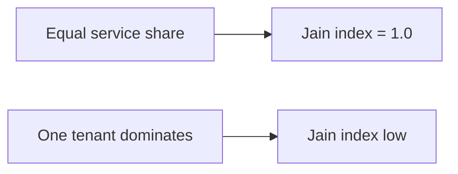

# 01 — Performance Metrics

> This note explains the metrics used in the InterruptLLM paper: latency, P99, throughput, SLA violation, and fairness.

## Latency

**Latency** is the time from when a request arrives until it finishes.

For LLM inference, latency can be split into:

- **TTFT (Time to First Token):** time until the first generated token is produced.
- **TPT (Time Per Token):** average time between generated tokens.
- **Total latency:** TTFT + (number of tokens × TPT) + queueing time.

InterruptLLM focuses on total latency, especially P99 latency.

## Percentiles

Percentiles are the main way to measure tail latency.

For a sorted list of latencies:

- **P50** = median
- **P90** = 90% of requests are faster
- **P99** = 99% of requests are faster
- **P99.9** = 99.9% of requests are faster

> [!important]
> The paper reports **P99 latency per priority class**. This means: for each class (P0, P1, P2, P3), 99% of requests in that class finish faster than the reported value.

## Throughput

**Throughput** is the number of tokens generated per second (tok/s).

$$\text{Throughput} = \frac{\text{total tokens generated}}{\text{total time}}$$

The paper reports throughput as a way to measure efficiency. A scheduler might reduce latency but also reduce throughput.

> [!important]
> InterruptLLM reduces P0 latency by 8.8× with only 2.2% throughput loss. This is a strong result because it shows the trade-off is small.

## SLA violation rate

An **SLA (Service Level Agreement)** is a target latency. The paper uses:

- P0 target: < 200 ms
- P1 target: < 1 s

The **SLA violation rate** is the fraction of requests that exceed their target.

| Metric | Value in paper |
|---|---|
| P0 SLA violation (FCFS at ρ=0.93) | 100% implied |
| P0 SLA violation (InterruptLLM at ρ=0.93) | 0% |

> [!important]
> Eliminating P0 SLA violations is one of the paper's main claims.

## Fairness

The paper uses two fairness metrics:

### Service-share Jain index

The **Jain index** measures how equally resources are distributed among tenants.

$$J(x_1, x_2, \ldots, x_n) = \frac{(\sum x_i)^2}{n \sum x_i^2}$$

- $J = 1$ means perfectly equal shares.
- $J = 1/n$ means one tenant gets everything.

The paper reports a service-share Jain index of 1.0, meaning no tenant is starved.

### Weighted Jain index

The weighted Jain index accounts for priority weights. A value of 0.90 means lower-priority tenants receive somewhat less service, but not catastrophically so.

## P1/P0 P99 ratio

The paper introduces the **P1/P0 P99 ratio** to make the latency trade-off explicit.

$$\text{ratio} = \frac{\text{P1 P99 latency}}{\text{P0 P99 latency}}$$

- At ρ=0.93, InterruptLLM has a ratio of 19×, meaning P1 requests are much slower than P0 requests.
- This is intentional: P0 is protected at the expense of P1.

> [!important]
> A high ratio is not necessarily bad if it reflects a deliberate design choice. The paper argues that interactive users need low latency, while batch users tolerate delays.

## Load factor

The **load factor** ρ (rho) measures how close the system is to capacity.

$$\rho = \frac{\text{offered load}}{\text{GPU capacity}}$$

- ρ < 1: underloaded
- ρ = 1: fully loaded
- ρ > 1: overloaded (queue grows)

The paper sweeps ρ from 0.56 to 1.11.

## How this connects to InterruptLLM

Every table and figure in the paper uses these metrics:

- Table II: scheduler comparison at ρ=0.76 (P0/P1 P99, throughput, Jain, SLA violation, preemptions).
- Figure 3: P0 P99 vs. load factor.
- Figure 4: swap latency (measured vs. modeled).
- Table IV: ablation (P0 P99, P1 P99, throughput, preemptions).

> [!important]
> To read the paper, you must be fluent in these metrics.

## Check your understanding

- [ ] I can explain P99 latency.
- [ ] I can explain throughput and why it matters.
- [ ] I know the SLA targets used in the paper.
- [ ] I can compute the Jain index for a simple example.
- [ ] I understand the P1/P0 P99 ratio.
- [ ] I know what the load factor ρ represents.

## Exercises

1. Latencies: [10, 20, 30, 40, 50, 100, 200, 1000] ms. Compute P50, P90, and P99.
2. Compute the Jain index for service shares [10, 10, 10, 10] and [40, 0, 0, 0].
3. If P0 P99 = 56.5 ms and P1 P99 = 1077 ms, what is the P1/P0 ratio? Is this fair? Explain why or why not.
4. Why might a scheduler reduce P99 latency while keeping throughput nearly the same?

> [!warning]
> P99 is not the maximum. P99 is the 99th percentile. In the paper, P99 is computed over 20 runs, so it is the average tail behavior, not the single worst-case run.
