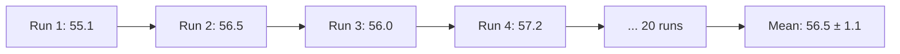

# 02 — Confidence Intervals

> This note explains why the paper reports mean ± standard deviation and why multiple runs are necessary.

## Why experiments vary

Even with the same code and the same dataset, experiments can give slightly different results because of:

- Random arrival times
- Random sampling
- Hardware timing variation
- Operating system noise

To report reliable numbers, researchers run the experiment many times and summarize the distribution.

## Mean and standard deviation

The paper reports numbers like:

$$56.5 \pm 1.1\text{ ms}$$

This means:

- **Mean** $\bar{x} = 56.5$ ms
- **Standard deviation** $\sigma = 1.1$ ms

The standard deviation measures how much the individual runs vary around the mean.



## How many runs are enough?

There is no magic number. Common choices are:

- 10 runs: minimum for rough trends
- 20 runs: standard in many systems papers
- 30+ runs: needed for very tight confidence intervals

The paper uses **20 runs** for the multi-run experiments and **20 iterations** for the GPU benchmark.

> [!important]
> More runs reduce the standard error of the mean, but they also take more time. The paper uses 20 as a balance between reliability and cost.

## Standard error vs. standard deviation

- **Standard deviation (σ):** measures spread of individual runs.
- **Standard error of the mean (SEM):** measures uncertainty in the mean estimate.

$$\text{SEM} = \frac{\sigma}{\sqrt{n}}$$

For 20 runs, SEM is about σ / 4.5, much smaller than σ.

The paper reports **σ** (standard deviation), not SEM, because it shows the run-to-run variability a user would actually experience.

## Arrival-time jitter

The paper uses **±10% arrival-time jitter** in multi-run experiments. This means:

- Each request's arrival time is multiplied by a random factor between 0.9 and 1.1.
- This captures the uncertainty in real arrival patterns.

```python
# Pseudo-code
import random
random.seed(run_seed)
for req in requests:
    jitter = random.uniform(0.9, 1.1)
    req.arrival_time *= jitter
```

> [!important]
> Jitter tests whether the scheduler's conclusions are robust to small changes in arrival times.

## Confidence intervals

A confidence interval gives a range where the true mean likely lies.

A 95% confidence interval is approximately:

$$\bar{x} \pm 1.96 \times \text{SEM}$$

For the paper's reported values:

$$56.5 \pm 1.1 \text{ ms}$$

The 95% CI for the mean would be roughly:

$$56.5 \pm 1.96 \times \frac{1.1}{\sqrt{20}} \approx 56.5 \pm 0.5 \text{ ms}$$

> [!tip]
> The paper does not explicitly report confidence intervals, but the standard deviation gives you the same information. Small standard deviations mean the results are reproducible.

## How this connects to InterruptLLM

Every major table in the paper uses mean ± std:

- Table II: scheduler comparison at ρ=0.76
- Table III: swap latency (measured vs. modeled)
- Table IV: ablation study
- Figure 3: error bars on the load sweep

The reproducibility footnote also says experiments use fixed seeds: `seed=42` for workload, `0–19` for multi-run.

## Check your understanding

- [ ] I can explain why experiments are run multiple times.
- [ ] I can interpret $56.5 \pm 1.1$ ms.
- [ ] I know the difference between standard deviation and standard error.
- [ ] I understand what arrival-time jitter is and why it is used.

## Exercises

1. Compute the mean and standard deviation of [55.1, 56.5, 56.0, 57.2, 56.8].
2. Compute the standard error for the same data.
3. If the paper reported 10.0 ± 0.1 ms, is the result reliable? Why?
4. Why does the paper use ±10% jitter instead of running the same trace exactly 20 times?

> [!warning]
> A small standard deviation does not mean the result is correct. It means the measurement is reproducible. The result could still be wrong due to a flawed model or simulator assumption.
