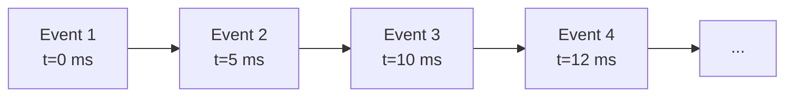
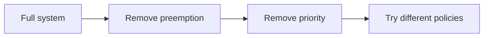

# 03 — Simulation and Ablation

> This note explains discrete-event simulation and ablation studies, the two main evaluation techniques used in the paper.

## What is a discrete-event simulation?

A **discrete-event simulation (DES)** models a system as a sequence of events at specific points in time.

Instead of simulating every nanosecond, the simulator jumps from one event to the next.

Events might include:

- A new request arrives.
- A decode iteration completes.
- A request finishes.
- A preemption happens.

> [!important]
> DES is efficient because it skips time when nothing changes. The InterruptLLM simulator advances one decode iteration at a time.

## What the simulator models

The InterruptLLM simulator models:

- A GPU with a fixed token-generation rate (300 tok/ms)
- A batch of up to 16 requests
- Request arrival times from a Kaggle trace
- Scheduling policies (FCFS, Priority, InterruptLLM, etc.)
- A per-preemption swap penalty (0.5 ms)

## What the simulator abstracts away

The simulator does not model:

- Individual CUDA kernels
- Kernel launch overhead
- CUDA graphs
- PyTorch allocator behavior
- Memory fragmentation
- Network communication

> [!important]
> Abstraction is deliberate. The simulator isolates scheduler behavior from GPU microarchitecture effects.

## Why simulate?

Simulation is useful when:

- Real-system implementation is complex and time-consuming.
- You want to isolate one variable (e.g., scheduler policy).
- You want to sweep many configurations.
- Real hardware is expensive or unavailable.

## Limitations of simulation

Simulation is not a substitute for a real implementation:

- Results depend on the model assumptions.
- Real overhead might be higher.
- Some effects are not captured.

The paper acknowledges this in Section VII.

## Ablation studies

An **ablation study** removes or disables components to see how much each contributes.

The paper's ablation (Table IV) compares:

- FCFS (no scheduler)
- Non-preemptive priority
- SSJF
- Lottery
- WFQ
- EDF
- MLFQ (preemptive)

By comparing these, the paper isolates the effect of preemption.

## Key ablation result

From Table IV:

- FCFS: 100 ms P0 P99
- Non-preemptive priority: 54.2 ms
- MLFQ (preemptive): 27.7 ms

> [!important]
> Non-preemptive policies reduce latency by ~2×. Preemption reduces it by an additional ~3.6×. This shows that **preemption is the dominant factor**, not just priority reordering.

## Threats to validity

The paper also discusses threats to validity:

- **Internal validity:** Are the results caused by the scheduler, not confounding factors? The 20-run jitter and fixed seeds help here.
- **External validity:** Do the results generalize to other traces and hardware? The Kaggle trace is public, but not all production behaviors are captured.
- **Construct validity:** Are the metrics measuring what we care about? P99 and Jain are good but not complete.

> [!important]
> A strong paper acknowledges what it does not show. The InterruptLLM paper is clear about its simulator limitations.

## How this connects to InterruptLLM

Section V of the paper explains the simulator. Section VI-E presents the ablation. Section VII discusses limitations.

To understand these sections, you must know:

- What DES is and why it is used.
- What is modeled vs. what is abstracted.
- How ablation isolates the contribution of preemption.
- What threats to validity mean.

## Check your understanding

- [ ] I can explain discrete-event simulation.
- [ ] I can list what the InterruptLLM simulator models and what it abstracts.
- [ ] I understand why ablation studies are useful.
- [ ] I can explain the three types of validity threats.

## Exercises

1. Why does the simulator advance one decode iteration at a time instead of modeling every CUDA kernel?
2. What does the ablation study reveal about the importance of preemption?
3. List one threat to internal validity and one to external validity for the InterruptLLM paper.
4. If the simulator omitted swap penalty entirely, what would happen to the results?

> [!warning]
> Simulation is a powerful tool, but it is only as good as its assumptions. The paper's main assumption is the 0.5 ms swap penalty, which is calibrated against the real P100 benchmark.
