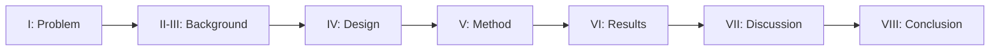

# 01 — Paper Overview and Structure

> This note is the first of the paper-reading modules. It maps the paper's sections and explains the high-level narrative.

## Paper metadata

| Field | Value |
|---|---|
| **Title** | InterruptLLM: A Preemptive Scheduling Framework for Low-Latency Multi-Tenant LLM Inference |
| **Target venue** | Workshop at OSDI/SOSP/NSDI (ICCIT 2026 / IEEE Access in proposal) |
| **Main claim** | Decode-stage, block-granular preemption reduces interactive P99 latency by 8.8× with 2.2% throughput loss. |
| **Hardware validated** | NVIDIA P100 GPU swap benchmark |
| **Trace used** | Kaggle: bektursyn/llm-inference-logs-and-performance-metrics |

## Paper structure

| Section | Title | What it covers |
|---|---|---|
| I | Introduction | Problem, contributions, main results |
| II | Background and Motivation | LLM inference, continuous batching, PagedAttention |
| III | Related Work | Existing systems and why they fall short |
| IV | System Design | InterruptLLM architecture, MLFQ, swapper, checkpoint engine |
| V | Implementation and Evaluation Methodology | Simulator, assumptions, metrics |
| VI | Results | Tables and figures with numbers |
| VII | Discussion and Future Work | Limitations, threats, integration |
| VIII | Conclusion | Summary |

## The four contributions

The paper claims four contributions:

1. **Formalizing head-of-line blocking** in multi-tenant LLM serving.
2. **Designing InterruptLLM**: MLFQ scheduler, hierarchical swapper, checkpoint engine.
3. **Implementing and validating** the simulator with a real P100 swap benchmark.
4. **Evaluating** on a Kaggle trace, showing 8.8× P99 latency reduction.

> [!important]
> The paper is careful not to claim it is the "first" to preempt; it says it is "a preemptive scheduling framework." This wording matters for academic honesty.

## Main numbers to remember

| Result | Value |
|---|---|
| P0 P99 reduction over FCFS (ρ=0.93) | 499.2 ms → 56.5 ms (8.8×) |
| P0 P99 reduction over Priority (ρ=0.93) | 116.7 ms → 56.5 ms (2.1×) |
| Throughput loss | 2.2% |
| Average preemption overhead | 0.07 ms per request |
| Service-share Jain index | 1.0 |
| P1/P0 P99 ratio (ρ=0.93) | 19× |

## How to read the paper with this curriculum

Use the following mapping:

- **Sections I–II:** rely on [[02-llm-fundamentals]] and [[05-llm-serving-systems]].
- **Section III:** relies on [[05-llm-serving-systems]] and [[04-operating-systems-concepts]].
- **Section IV:** relies on [[03-gpu-and-memory]], [[04-operating-systems-concepts]], and [[05-llm-serving-systems]].
- **Sections V–VI:** rely on [[06-evaluation-methodology]].
- **Section VII:** relies on [[08-critical-analysis]].

> [!tip]
> Read each section of the paper, then read the corresponding note here. The notes explain terminology and connect claims to background modules.

## Check your understanding

- [ ] I can name the four main contributions of the paper.
- [ ] I know the main latency improvement number.
- [ ] I understand the paper's structure.
- [ ] I know which background modules support each section.

## Exercises

1. What is the paper's central problem statement?
2. Why does the paper avoid saying it is the "first" preemptive LLM scheduler?
3. Map each paper section to the corresponding reading-the-paper note.

> [!question]
> Before moving on, ask yourself: what would make you skeptical of the 8.8× claim? Keep that question in mind as you read the rest of the paper.
