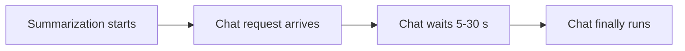

# 02 — Problem and Motivation

> This note guides you through Sections I–II of the paper: the introduction and background/motivation.

## Key claims in Section I (Introduction)

The introduction makes three moves:

1. **Establish the problem:** LLM serving systems use continuous batching, which is non-preemptive.
2. **Show the impact:** A single long request can block short interactive requests, inflating P99 latency up to 17×.
3. **Introduce the solution:** InterruptLLM adds preemptive scheduling with a hierarchical swapper.

## The non-preemptive problem

From the paper:

> "Modern LLM serving systems ... use continuous batching to saturate GPU arithmetic units. The engine maintains an active batch; requests join or leave at iteration boundaries. While this improves throughput, it is cooperative and non-preemptive."

In plain English: once a request starts decoding, it stays in the batch until it finishes. New urgent requests cannot evict it.

## The 128K-token example

The paper uses a concrete example:

- A 128K-token summarization request can monopolize the GPU for 5–30 seconds.
- During that time, a short chat request arriving must wait.

## Why existing remedies fall short

The paper lists several approaches and their limitations:

| Approach | Limitation |
|---|---|
| Continuous batching | Cannot evict running requests |
| Priority queues | Only reorder admission |
| Speculative decoding | Faster for all, but no priority reordering |
| Request migration | Full KV-cache transfer is too slow |

> [!important]
> The paper's gap statement: no existing system provides decode-stage, block-granular preemption with sub-10 ms overhead for interactive LLM requests.

## Section II-A: LLM Inference and Continuous Batching

This subsection reviews:

- **Prefill:** process prompt, build KV cache.
- **Decode:** generate one token per iteration.
- **Continuous batching:** add/remove requests at iteration boundaries.

It states the key issue:

> "Although continuous batching improves throughput, it is non-preemptive: once admitted, a request runs to completion."

## Section II-B: PagedAttention

This subsection explains that vLLM stores KV caches in fixed-size blocks with a per-request block table.

Key sentence:

> "Each block is self-contained ... making it independently swappable between GPU HBM, CPU DRAM, and SSD."

This is the enabling technology for InterruptLLM.

## Section II-C: Why Existing Schedulers Cannot Preempt

This subsection says existing schedulers can reorder admission but cannot evict running requests mid-iteration.

Figure 1 in the paper visualizes this:

- FCFS: chat waits behind batch.
- InterruptLLM: batch is preempted, chat runs, batch resumes.

## Connections to background modules

| Concept in paper | Module |
|---|---|
| Prefill vs. decode | [[03-autoregressive-generation]] |
| KV cache | [[04-kv-cache-explained]] |
| Continuous batching | [[02-continuous-batching]] |
| PagedAttention | [[01-vllm-and-pagedattention]] |
| Priority inversion | [[03-priority-inversion-problem]] |

## Check your understanding

- [ ] I can explain the non-preemptive nature of continuous batching.
- [ ] I understand the 128K-token blocking example.
- [ ] I can explain why PagedAttention enables preemption.
- [ ] I can summarize Section I in one paragraph.

## Exercises

1. Write a one-sentence summary of the paper's problem statement.
2. Why does the paper say continuous batching is "cooperative"?
3. What is the role of PagedAttention in making preemption feasible?
4. Figure 1 shows two timelines. Draw them from memory.

> [!warning]
> The introduction's "17×" number is an upper-bound example. The actual measured number in results is 8.8×. Do not confuse the motivating example with the final result.
