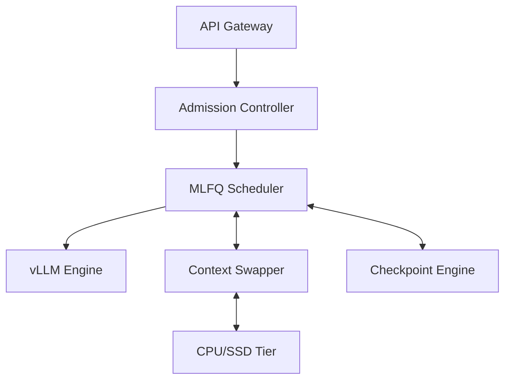
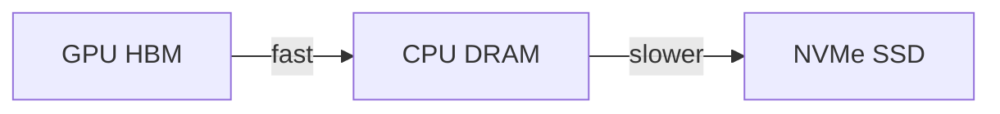

# 03 — System Design Deep Dive

> This note guides you through Section IV of the paper: the InterruptLLM architecture and its components.

## Section IV overview

Section IV describes the four main components of InterruptLLM:

1. **Admission Controller**
2. **MLFQ Scheduler**
3. **Context Swapper**
4. **Checkpoint Engine**

## Admission Controller

The Admission Controller decides whether to accept or reject requests based on predicted resource needs and current load.

Key behaviors:

- If admitting a request would violate an SLA, it tries to preempt lower-priority work first.
- If no victim exists, it queues or rejects the request.
- Decisions are re-evaluated at each iteration boundary.

> [!important]
> The Admission Controller is the "gatekeeper." It protects the system from overload by rejecting work that cannot be served.

## MLFQ Scheduler

The scheduler maintains four priority classes:

| Class | Workload | Target |
|---|---|---|
| P0 | Interactive (chat, code completion) | P99 < 200 ms |
| P1 | Standard API requests | P99 < 1 s |
| P2 | Batch (summarization, embedding) | Best-effort |
| P3 | Background | Preemptible anytime |

Within each class, requests are served round-robin. Across classes, strict priority is enforced.

### Aging

A request that waits too long is promoted to the next higher class. This prevents starvation.

> [!important]
> Aging is a safety mechanism. In the experiments, it has little effect because P0 arrivals are frequent.

### Victim selection

When a higher-priority request needs space, the scheduler preempts:

1. A request with lower priority than the arriving request.
2. Among those, the one with the largest KV footprint.

Reasoning: evicting the largest victim frees the most memory.

## Context Swapper

The Context Swapper has two tiers:

### Tier 1: GPU HBM → CPU DRAM

- Uses `cudaMemcpyAsync` or GPUDirect RDMA.
- CPU DRAM is sized to 4× GPU memory (e.g., 320 GB for an 80 GB GPU).
- Fast path for recently preempted requests.

### Tier 2: CPU DRAM → NVMe SSD

- Used when CPU memory is full.
- Blocks are compressed with LZ4.
- Slower, but much larger capacity.

## Checkpoint Engine

The Checkpoint Engine captures per-request metadata:

- Block-table mapping
- Position IDs
- Sampling state
- Prompt/generated token counts

This metadata is ~16 bytes/token, much smaller than the KV cache.

Example from the paper:

- 128K tokens × 16 bytes/token ≈ 2 MB of checkpoint metadata
- The KV cache for the same request can be multi-gigabytes

> [!important]
> The checkpoint is small because it stores metadata, not the actual K/V vectors. The swapper moves the K/V vectors.

## Design rationale summary

| Component | Problem it solves |
|---|---|
| Admission Controller | Overload protection |
| MLFQ Scheduler | Priority-based scheduling and preemption |
| Context Swapper | Where to put preempted KV cache |
| Checkpoint Engine | How to resume state cheaply |

## Connections to background modules

| Component | Module |
|---|---|
| MLFQ Scheduler | [[03-mlfq-deep-dive]] |
| Context Swapper | [[01-gpu-memory-hierarchy]], [[03-measuring-swap-latency]] |
| Checkpoint Engine | [[04-kv-cache-explained]] |
| Block tables | [[04-virtual-memory-and-paging]] |

## Check your understanding

- [ ] I can name the four components of InterruptLLM and their roles.
- [ ] I know the four priority classes and their targets.
- [ ] I understand the two-tier swapper.
- [ ] I know why checkpoint metadata is small.

## Exercises

1. Why does the Admission Controller reject requests rather than always preempting?
2. What happens if a P0 request arrives while the batch is full of P0 requests?
3. Why is the largest-footprint victim chosen?
4. How big is the checkpoint for a 128K-token request? How does that compare to the KV cache?

> [!question]
> Think about the trade-off between Tier 1 and Tier 2. What policy would you use to decide whether to keep a preempted request in CPU DRAM or push it to SSD?
