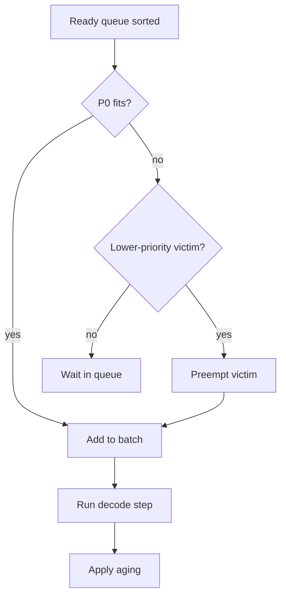

# 04 — Algorithm and Complexity

> This note guides you through Algorithm 1 and the complexity analysis in Section IV-E of the paper.

## Algorithm 1: MLFQ Scheduling Loop

The algorithm in the paper is the formal scheduling loop. Here it is in pseudocode with line-by-line explanation:

```
B ← ∅           // running batch
Q ← ∅           // ready queue

loop:
    Enqueue new arrivals into Q
    Sort Q by priority (P0 > P1 > P2 > P3)

    for each request r in Q by priority:
        if |B| < batch_capacity:
            B ← B ∪ {r}
        else if r.priority < min priority in B:
            v ← request in B with largest kv_blocks
            Preempt(v)              // checkpoint + swap KV blocks
            B ← (B \ {v}) ∪ {r}

    RunDecodeStep(B)                // advance one token per request
    ApplyAging(Q)                   // promote long-waiting requests
```

## Step-by-step explanation

### 1. Enqueue new arrivals

At the start of each iteration, new requests that arrived since the last iteration are added to the ready queue $Q$.

### 2. Sort by priority

The ready queue is sorted so that P0 requests come first, then P1, then P2, then P3.

Sorting cost: $O(n \log n)$ where $n$ is the number of pending requests.

### 3. Fill the batch

The scheduler tries to add requests to the running batch $B$ up to the batch capacity (16 in the paper).

### 4. Preempt if necessary

If a high-priority request does not fit and the batch contains lower-priority requests, the scheduler:

1. Selects the lowest-priority victim with the largest KV footprint.
2. Calls `Preempt(v)`, which checkpoints metadata and swaps KV blocks.
3. Removes the victim from the batch.
4. Adds the high-priority request to the batch.

### 5. Run one decode step

All requests in $B$ advance by one token.

### 6. Apply aging

Requests that have waited longer than a threshold are promoted to a higher-priority class.

## Complexity analysis

The paper states the per-iteration cost is dominated by sorting:

$$O(n \log n + |B|)$$

where:

- $n$ = number of pending requests
- $|B|$ = batch size

| Operation | Cost |
|---|---|
| Sorting Q | $O(n \log n)$ |
| Victim selection | $O(|B|)$ |
| Checkpoint capture | $O(k)$ where $k \approx 16 \times \text{tokens}$ bytes |
| KV swap | $O(b \cdot s / \text{bandwidth})$ |
| Memory overhead per request | $O(k)$ |

> [!important]
> The scheduler's compute overhead is small compared to the GPU decode step. The real cost is the KV swap, which happens only when preemption occurs.

## Visual walkthrough

Imagine the batch capacity is 2, and the ready queue has:

```
Q = [P0-A, P0-B, P1-C, P2-D]
B = [P1-C, P2-D]    // currently running
```

Iteration:

1. Sort Q: [P0-A, P0-B, P1-C, P2-D]
2. Try P0-A: B has space after preempting a lower-priority request.
3. Preempt P2-D (lower priority than P0-A), swap KV blocks.
4. B = [P1-C, P0-A]
5. Try P0-B: batch is full, and no victim is lower than P0. Wait in Q.
6. Run decode step.
7. Apply aging.



## Connections to background modules

| Concept | Module |
|---|---|
| MLFQ scheduling | [[03-mlfq-deep-dive]] |
| Big-O notation | [[03-math-foundations]] |
| Victim selection | [[03-mlfq-deep-dive]] |
| KV swap cost | [[03-measuring-swap-latency]] |

## Check your understanding

- [ ] I can explain Algorithm 1 step by step.
- [ ] I know the complexity of each part.
- [ ] I understand why sorting dominates the scheduler's compute cost.
- [ ] I can trace through a small example.

## Exercises

1. What is the time complexity of sorting the ready queue?
2. Why is the KV swap cost separate from the scheduling cost?
3. Trace through Algorithm 1 with batch capacity 2 and ready queue [P0, P1, P2].
4. What does `ApplyAging` prevent?

> [!tip]
> When reading Algorithm 1 in the paper, do not just read it once. Trace through it with a concrete example. This is the most important algorithm in the paper.
