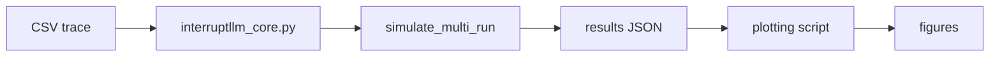

# 01 — Codebase Walkthrough

> This note maps the project files and explains what each part does. It prepares you to run the simulator and read the source code.

## Project layout

```
ICCIT/
├── paper/                    # LaTeX paper
│   ├── main.tex              # Main paper file
│   └── references.bib        # Bibliography
├── src/                      # Core library
│   └── interruptllm_core.py  # Simulator and shared utilities
├── scripts/                  # Local analysis scripts
│   ├── run_local_multirun.py   # Run 20 local simulations
│   └── generate_paper_extras.py # Ablation studies
├── templates/                # Kaggle notebook templates
│   ├── phase2a.py            # Scheduler comparison
│   ├── phase4a.py            # Load sweep
│   └── phase5a.py            # GPU swap benchmark
├── data/                     # Dataset
│   └── llm_inference_logs.csv  # Kaggle trace
├── results/                  # Output directory
├── pipeline.py               # Kaggle pipeline CLI
├── config.yaml               # Pipeline configuration
└── requirements.txt          # Python dependencies
```

## Key files explained

### `src/interruptllm_core.py`

This is the heart of the project. It contains:

- `load_llm_trace()`: reads the CSV dataset
- `build_requests_from_trace()`: converts CSV rows into request objects
- `simulate_*()`: different simulation functions
- `simulate_multi_run()`: runs the experiment multiple times with jitter
- Scheduler policies: FCFS, Priority, SSJF, Lottery, WFQ, EDF, MLFQ
- Metrics computation: P99, throughput, Jain, SLA violations

### `templates/phase2a.py`

This notebook runs the scheduler comparison at fixed load (ρ=0.76). It imports the core library and prints `[RESULT]` lines.

### `templates/phase4a.py`

This notebook runs the load sweep across multiple load factors (ρ=0.56 to 1.11).

### `templates/phase5a.py`

This notebook runs the GPU swap benchmark on a Kaggle P100. It measures `cudaMemcpyAsync` latency for various block sizes.

### `scripts/run_local_multirun.py`

This script runs the phase2a and phase4a experiments locally without Kaggle. It is the easiest way to reproduce the paper results.

### `scripts/generate_paper_extras.py`

This script generates the ablation study results (Table IV) on a synthetic workload.

### `pipeline.py`

This CLI manages Kaggle notebook execution:

- `upload-src`: uploads core library as a Kaggle dataset
- `generate`: creates notebook files from templates
- `push`: uploads notebooks to Kaggle
- `wait`: waits for completion
- `fetch`: downloads results
- `results`: displays results

### `config.yaml`

Configuration file listing the phases to run (phase2a, phase3a, phase4a, phase5a).

## Data flow



## How results are reported

The core library prints greppable lines like:

```
[RESULT] p0_p99_ms = 56.5 ± 1.1
[RESULT] throughput_tok_s = 260006
```

`pipeline.py` parses these lines to collect results.

## Key functions to understand

When reading `interruptllm_core.py`, focus on these functions:

| Function | Purpose |
|---|---|
| `load_llm_trace()` | Loads CSV data |
| `build_requests_from_trace()` | Creates request objects with random offsets |
| `simulate_mlfq()` | Runs the MLFQ scheduler |
| `simulate_fcfs()` | Runs the FCFS baseline |
| `simulate_priority()` | Runs the priority baseline |
| `simulate_multi_run()` | Runs multiple seeds with jitter |
| `compute_metrics()` | Computes P99, throughput, etc. |

## What to expect in the code

The simulator is intentionally written in NumPy/standard Python without a deep learning framework. This is because:

- It runs on CPU-only Kaggle kernels.
- It focuses on scheduler behavior, not model accuracy.
- It abstracts GPU execution as a token-generation rate.

## Check your understanding

- [ ] I can navigate the project directory.
- [ ] I know the purpose of the core library.
- [ ] I know what each phase notebook does.
- [ ] I understand the data flow from CSV to figures.

## Exercises

1. Open `src/interruptllm_core.py` and find the `simulate_mlfq` function. Read its docstring.
2. Find the `format_result` function. Why are results printed in `[RESULT] ... = ...` format?
3. Open `config.yaml` and list the configured phases.
4. What does `pipeline.py` do? Read its help with `python pipeline.py --help`.

> [!tip]
> You do not need to understand every line of the core library immediately. Focus on the high-level flow: load data → simulate → compute metrics → save results.

> [!warning]
> The core library is designed to be framework-free. It does not import PyTorch or vLLM. The GPU benchmark notebook is the only part that uses PyTorch.
